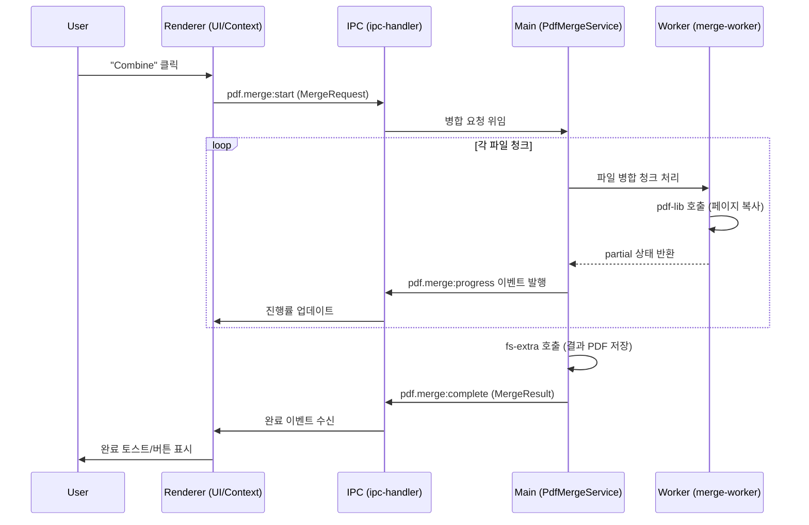
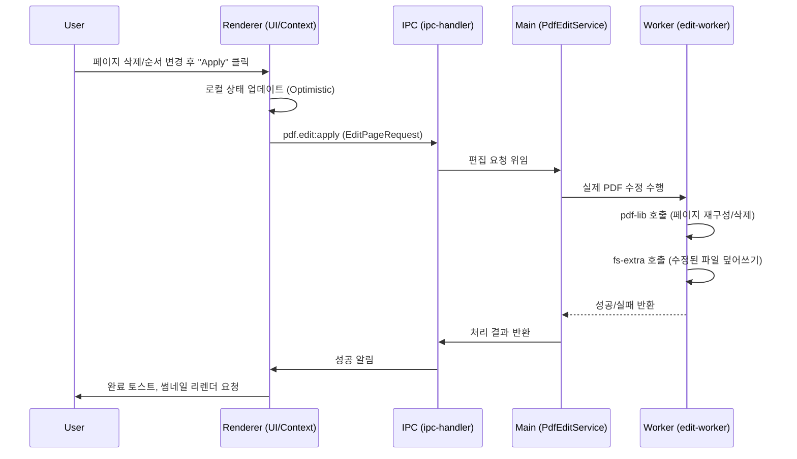
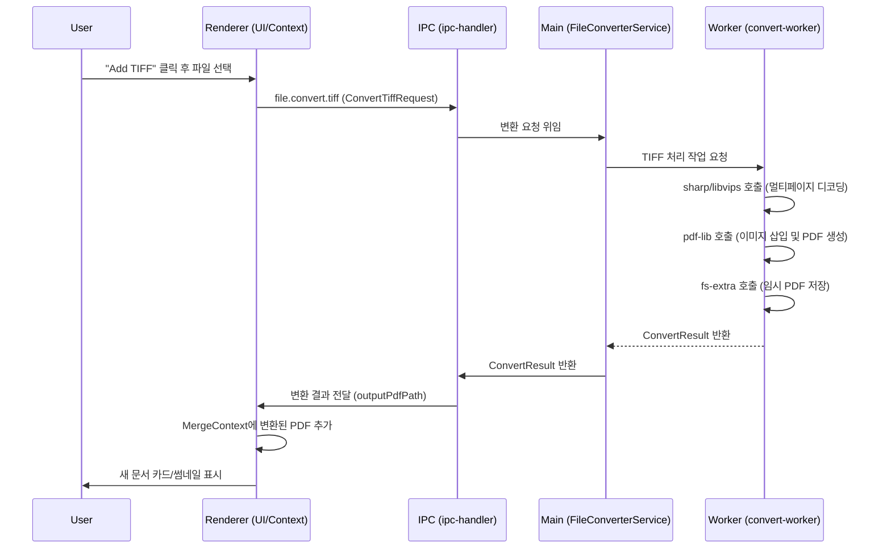

# 🔁 서비스 시퀀스 다이어그램

핵심 기능 3가지의 서비스 간 상호작용 및 데이터 흐름입니다.

## 1. PDF 병합 시퀀스 (Merge)

### 흐름 개요

1. 사용자가 "Combine" 버튼 클릭
2. Renderer → Main으로 병합 요청 전송
3. Worker에서 청크 단위로 병합 처리
4. 진행률 실시간 업데이트
5. 완료 후 결과 파일 경로 반환

### 시퀀스 다이어그램

### 주요 처리 로직

- **청크 단위 처리**: 대용량 PDF 병합 시 메모리 효율성 확보
- **Worker 분리**: Main 프로세스 블로킹 방지
- **실시간 진행률**: `pdf.merge:progress` 이벤트로 UI 업데이트

---

## 2. PDF 편집 시퀀스 (Edit)

### 흐름 개요

1. 사용자가 페이지 삭제/순서 변경 후 "Apply" 클릭
2. Optimistic UI 업데이트 (즉시 반영)
3. Main Process에서 실제 PDF 수정
4. 완료 후 썸네일 리렌더링

### 시퀀스 다이어그램

### 주요 처리 로직

- **Optimistic Update**: UI 즉시 반영으로 빠른 사용자 경험
- **페이지 재구성**: pdf-lib로 새 PDF 문서 생성 후 선택된 페이지만 복사
- **덮어쓰기**: 원본 파일 직접 수정 (또는 새 파일로 저장 옵션)

---

## 3. TIFF → PDF 변환 시퀀스 (Convert)

### 흐름 개요

1. 사용자가 TIFF 파일 선택
2. sharp/libvips로 멀티페이지 TIFF 디코딩
3. pdf-lib로 이미지 삽입 및 PDF 생성
4. 변환된 PDF를 MergeContext에 추가

### 시퀀스 다이어그램

### 주요 처리 로직

- **멀티페이지 지원**: TIFF의 여러 페이지를 각각 PDF 페이지로 변환
- **임시 파일 관리**: 변환된 PDF는 임시 디렉토리에 저장
- **자동 추가**: 변환 완료 시 자동으로 병합 대상 목록에 추가

---

## 사용 라이브러리 매핑

| 작업            | 라이브러리          | 위치     |
| --------------- | ------------------- | -------- |
| PDF 페이지 조작 | `pdf-lib`           | Worker   |
| TIFF 디코딩     | `sharp` / `libvips` | Worker   |
| 파일 I/O        | `fs-extra`          | Worker   |
| 썸네일 렌더링   | `pdf.js`            | Renderer |
